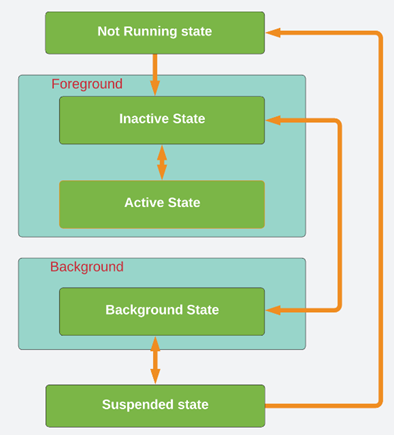

# Interview-Question

1. OOP

- Encapsulation: Là cách ta đóng gói dữ liệu và phương thức thành 1 class, điều này giúp dữ liệu được ẩn đi bằng cách sử dụng các access modifier như `open, public, internal,fileprivate, private.`
- Abstraction: Là cách ta hiển thị dữ liệu và phương thức mong muốn của đối tượng và ẩn đi các logic phức tạp bên trong. Điều này làm cho code dễ đọc, dễ maintain và sử dụng trong tương lai.
- Inheritance: Trong swift thì cho phép 1 class kế thừa 1 class khác. Trong swift chỉ cho phép đơn kế thừa, còn để đạt được trạng thái mong muốn là đa kế thừa thì ta có thể sử dụng protocol
- Polymorphism: Với cùng 1 method ở superclass, các subclass khác nhau có thể ovveride method đó để triển khai các cách khác nhau.

2. So sánh Class và Struct

Giống nhau:
- Đều có thể định nghĩa các thuộc tính để lưu giá trị, định nghĩa các method để thực thi các chức năng, định nghĩa các hàm khởi tạo init. Đều có thể kế thừa protocol. Và có thể được extend bởi extensions

Khác nhau:
- Điểm khác biệt lớn nhất là Class là reference Type còn Struct và Enum là Value Type. Vì vậy Class có cơ chế Reference counting cho phép nhiều hơn 1 reference refer tới 1 class instance. Và Class có hàm deinit, struct thì ko có  
- Điểm khác biệt thứ 2 là Class cho phép kế thừa còn Struct thì không.


3. Protocol và delegate là gì

Protocol: định nghĩa 1 blueprint cho các methods, propertie. Protocol có thể được adopted bởi class, struct, enum. Bất kì kiểu dữ liệu nào mà đáp ứng những methors và properties đó thì được gọi là đã comform protocol. 

Ta thường dùng protocol cho các trường hợp như:

- Khi ta muốn đảm bảo 1 kiểu dữ liệu phải có đủ các methods và properties mong muốn.
- Delegate
- Đa kế thừa

Trong swift, delegate là 1 design pattern cho phép 1 đối tượng gửi message tới 1 đối tượng khác khi có 1 sự kiện xảy ra. Khi sử dụng delegate, ta khai báo nó với kiểu tham chiếu weak để tránh retail cycle. Delegate là kiểu quan hệ 1 1

4. GCD

Trước khi nhắc đến `GCD` thì ta cần phải nhắc tới `Queue`. Queue là 1 hàng đợi block code để đợi các Thread thực thi. `GCD` là 1 low level API được cung cấp để quản lý Queue, công việc chính của GCD là: Tạo Queue, Đưa các block code vào trong Queue. GCD cho phép ta tạo 2 loại Queue:
- Serial Queue: Các block code được thực thi lần lượt
- ConcurrentQueue: Các block code được thực thi đồng thời.

5. Có bao nhiêu mức Access Control trong Swift? Hãy liệt kê chúng theo thứ tự giảm dần 

Trong swift có 5 mức Access Control đó là: `Open, Public, Internal, fileprivate, private`

- `Open Access`: Thì class đó có thể được truy cập và kế thừa từ mọi source file mà import module này, các phương thức hoặc thuộc tính của class Open có thể được Override từ các source file đó. 
- `Public Access`: Thì class Public đó chỉ có thể được truy cập từ các source file mà import module này, chứ ko thể kế thừa hoặc override các thuộc tính các class public.
- `Internal Access`: Chỉ các entity trong Module đó mới có quyền truy cập vào class Internal
- `Fileprivate Access`: Chỉ các entity trong file đó mới có quyền truy cập vào fileprivate class
- `Private Access`: Chỉ có thể được truy cập ở bên trong class khai báo nó.

6. Quản lý bộ nhớ trong IOS thế nào
Swift sử dụng `ARC` để theo dõi và quản lý memory. `ARC` sẽ theo dõi số lượng refercence tới instance. Khi số lượng reference về 0, vùng nhớ đó sẽ được thu hồi.

ARC là 1 thuộc tính của trình biên dịch, thay vì người dùng phải tự mình thu hồi các vùng nhớ ko sử dụng thì compiler sẽ làm nó 

7. Strong and Weak

Strong Reference là 1 kiểu tham chiếu được sử dụng để giữ đối tượng trong bộ nhớ. Weak Reference không làm tăng . Weak thường được sử dụng để tránh retain cycles

8. IOS Application Life Cycle

Các trạng thái của 1 IOS Application: `Not Running, In Active, Active, Backgound, Suspended.`
- `Not Running:` Khi chúng ta mở máy lên thì chưa có ứng dụng nào được chạy, và tất cả các App ở trạng thái `Not Running`.
- `Active`: Sau khi ta nhấn vào biểu tượng App trên điện thoại chúng ta, thì App chúng ta vào trạng thái `InActive`(Kiểu lúc nó mới Lauch thì ra màn hình trắng, và ko thể tương tác với UI của App vì nó chưa được load xong UI 😊)) rồi về trạng thái `Active` và chạy trên `Foregroud`, lúc này người dùng có thể tương tác với giao diện của App. Khi App đã được mở sẵn nhưng chạy trên Backgroud, thì khi người dùng mở lại App thì App đang từ trạng `Background` sẽ về trạng `InActive` rồi về `Active`.
- `In-Active`: Trong các trường hợp như có các cuộc gọi hoặc tin nhắn tới, thì lúc này App rơi vào trạng thái `In-Active`. Lúc này App vẫn chạy trên `ForeGround`, nhưng không nhận bất kì sự kiện tương tác nào của người dùng.
- `Background`: Khi người dùng nhấn home để về màn hình chính hoặc sử dụng 1 App khác thì App hiện tại sẽ chạy dưới background nhưng vẫn thực thi code. Khi người dùng nhấn home, App từ trạng thái Active sẽ về In-Active rồi về trạng thái Backgroud
- `Suspended:` App chạy dưới `Backgroud` nhưng không thực thi code.



9. Mô hình MVC và MVVM

MVC gồm 3 thành phần là Model, View, Controller:
- `Model`: Đại diện cho dữ liệu, chứa thông tin và login của ứng dụng ? `Có chứa login ko ???`
- `View`: Đại diện cho giao diện của người dùng của ứng dụng, hiển thị dữ liệu từ model, cho phép người dùng tương tác với ứng dụng
- `Controller`: Đại diện cho login điều khiển của ứng dụng, là cấu nối giữa model và view, xử lý các yêu cầu từ view sau đó update view và model. 

Mô hình MVVM gồm 3 thành phần là `Model, View và ViewModel`:
- View: Chỉ thực hiện nhưng công việc liên quan đến giao diện: Như là lấy dữ liệu từ viewModel và sau đó hiển thị thông tin.
- ViewModel: Nhận thông tin từ ViewController, xử lý tất cả các thông tin này, sau đó gửi lại cho VC
- Model: Đại diện cho dữ liệu của ứng dụng

Flow dữ liệu của MVVM:
- Đầu tiên 1 ViewController sẽ có 1 tham chiến tới ViewModel
- ViewController sẽ nhận ã vài hành động của user, và sau đó sẽ gọi tới ViewModel
- ViewModel sẽ request APIService, sau đó trả response ngược lại cho viewModel
- Khi viewModel nhận response, ViewModel sẽ thông báo cho ViewController thông qua Binding
- View sẽ update UI với Data vừa nhận được

10. Closure

Closure là một block code mà có thể được sử dụng trong code. Closure có thể capture và store reference bất kì 1 biến hay 1 constant nào từ context mà nó được defined. 
- [Capturing Values](https://docs.swift.org/swift-book/documentation/the-swift-programming-language/closures/#Capturing-Values): 

Closure có thể capture và store reference bất kì 1 biến hay 1 constant nào từ context mà nó được defined. Closure có thể refer và modify giá trị của biến trong body của nó ngay cả khi phạm vi ban đầu(`original scope`) mà defined biến đó không còn tồn tại.

Closures Are Reference Types.

```swift
func makeIncrementer(forIncrement amount: Int) -> () -> Int {
    var runningTotal = 0
    func incrementer() -> Int {
        runningTotal += amount
        return runningTotal
    }
    return incrementer
}


var incre = makeIncrementer(forIncrement: 10)
```

Ta thấy func `makeIncrementer` return lại ã closure nên biến `incre` là 1 closure. Mà closure là 1 `reference type`, nên `incre` sẽ tham chiếu tới closure `incrementer`. Mà `runningTotal` capturing value 2 biến 


